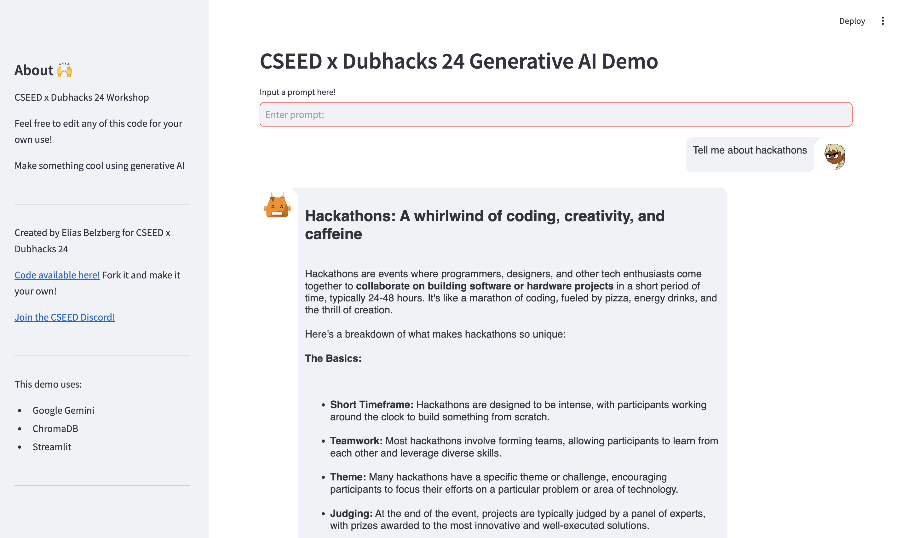
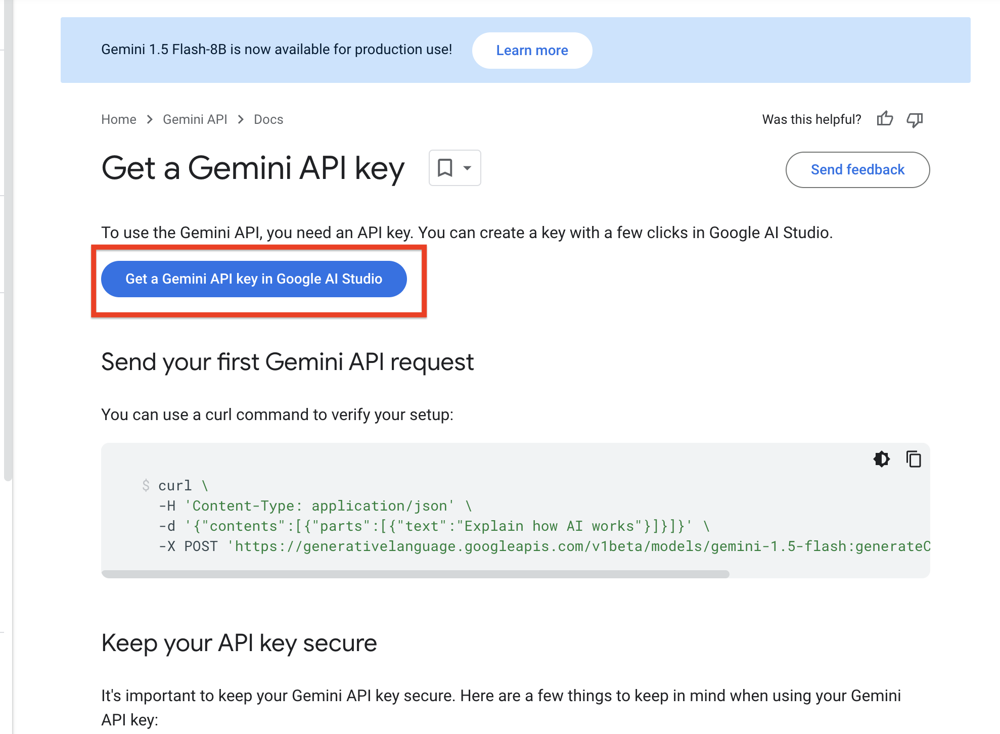
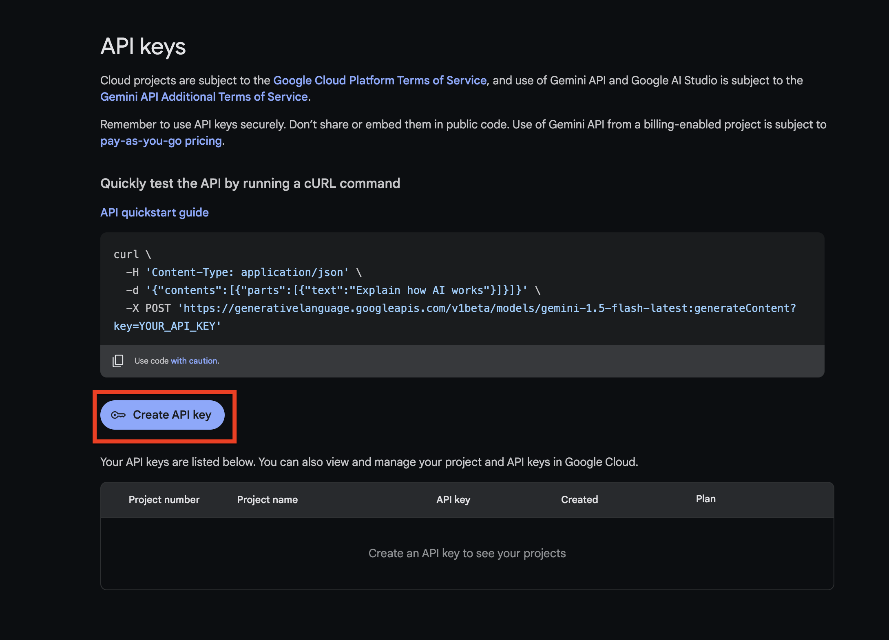
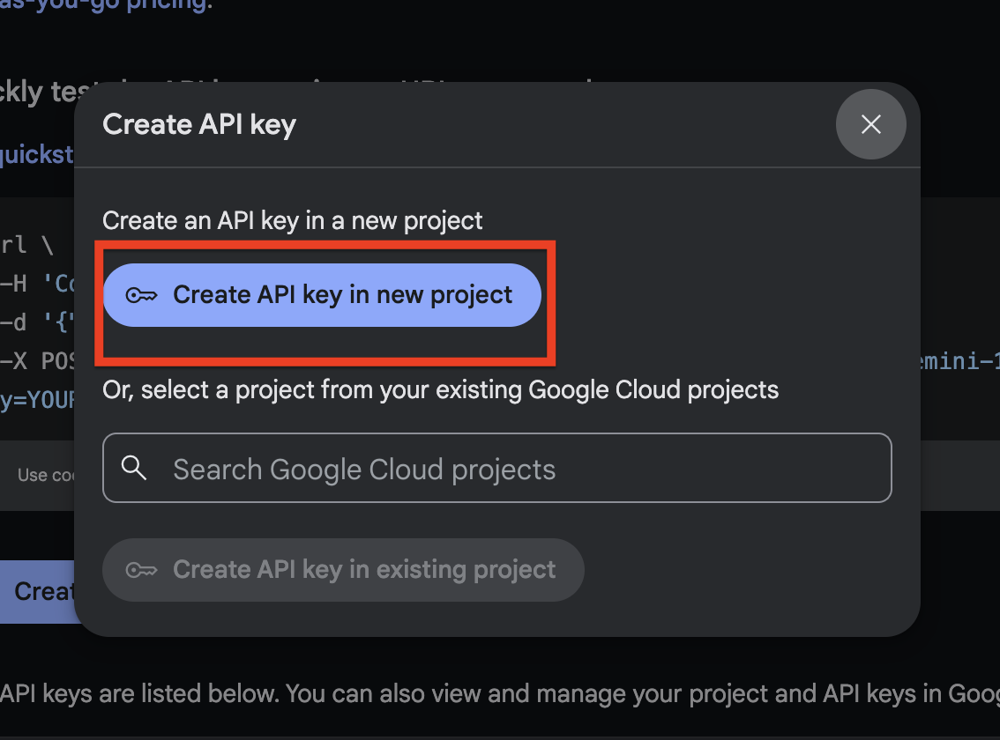

# CSEED x DUBHACKS 2024 Workshop
Make a custom chatbot with Streamlit, Gemini, and ChromaDB!
<br/>


## Setup

To set up the project, follow these steps:

1. **Create a Virtual Environment**:
   ```sh
    python3 -m venv venv
    # for window
    .\venv\Scripts\activate
    # for mac/linux
    source venv/bin/activate

    pip install -r requirements.txt
   ```

2. **Create google API key and add it to the .env file**:
  - Create a new project in the Google https://ai.google.dev/gemini-api/docs/api-key
  - Click the get a gemini api key button
    <br/>
    
  - Click create a new api key button
    <br/>
    
  - Create a new api project if needed or select an existing one
    <br/>
    
  - This will generate a API key, copy this key
  - Create a new file named `.env` in the root of the project and add the following line:
    ```sh
    API_KEY=<YOUR_API_KEY>
    ```

1. **Start Streamlit**:
   ```sh
   streamlit run chat.py
   ```

2. **Customize the chatbot!**:
   - Select a dataset from `/data` and copy the file path to the `FILE_PATH` variable in `load_data.py`. Then run `python3 load_data.py` to load the data into chromadb.
   - Uncomment the chromadb lines at the top of `chat.py` to link the database.
   - Modify the `chat.py` file to customize the chatbot and make it your own! Use the `query_db` function to query the database and return results to the llm.

